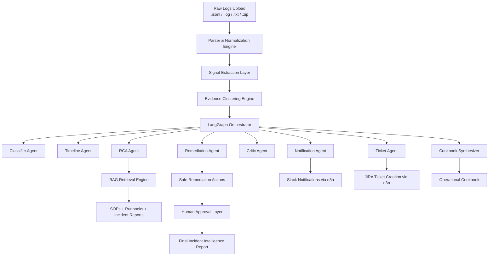
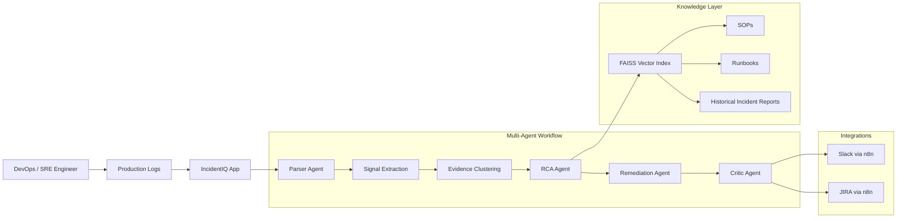
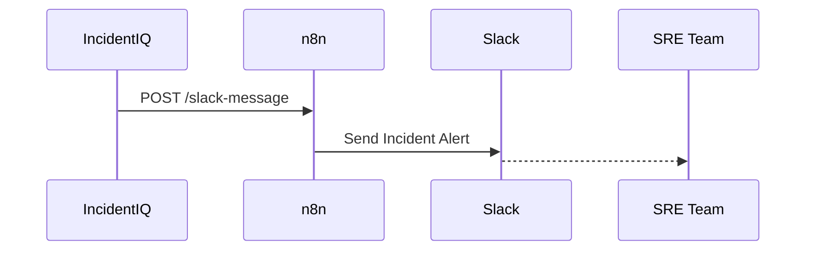
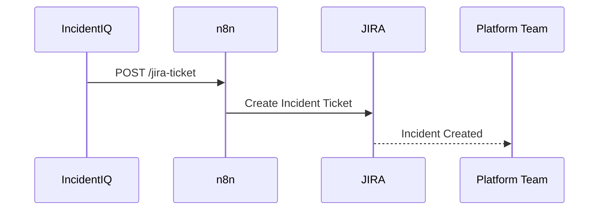

# IncidentIQ 🚨
## Multi-Agent AI Platform for DevOps Incident Detection, RCA & Automated Response

> **AI-Powered Incident Commander for DevOps, SRE & Platform Engineering Teams**

IncidentIQ is a production-inspired **multi-agent DevOps incident intelligence platform** that transforms noisy operational logs into:

- Incident detection
- Root cause analysis (RCA)
- Evidence-backed reasoning
- Automated remediation guidance
- Slack/JIRA operational actions
- Human-reviewable incident reports
- AI-generated runbooks and operational cookbooks

Built using **LangGraph**, **LLMs**, **RAG pipelines**, and **deterministic evidence extraction**, IncidentIQ demonstrates how modern AI Agents can automate incident triage and operational response workflows at scale.

---


---

# 🧠 What Makes IncidentIQ Different?

Unlike toy AI demos or simple keyword classifiers, IncidentIQ:

- Works on **messy, mixed production-style logs**
- Separates deterministic evidence extraction from LLM reasoning
- Uses **specialized collaborating agents** instead of one monolithic prompt
- Generates **traceable, explainable RCA**
- Uses **RAG-based operational intelligence**
- Prevents unsafe autonomous actions using approval gates
- Simulates realistic enterprise SRE workflows
- Integrates with external operational systems (Slack/JIRA)

---

# 🏗️ System Architecture

## High-Level Multi-Agent Architecture



---

## Infrastructure & Incident Flow



---

# 🔥 Core AI Concepts Demonstrated

| Concept | Implementation |
|---|---|
| Multi-Agent Systems | LangGraph orchestration |
| Agentic AI | Specialized reasoning agents |
| RAG (Retrieval-Augmented Generation) | FAISS + LangChain retrieval |
| Incident Intelligence | Evidence-based RCA |
| Deterministic AI Pipelines | Structured signal extraction |
| Human-in-the-loop AI | Approval-gated actions |
| DevOps Automation | Slack + JIRA workflows |
| Production Observability | Timeline reconstruction |
| Operational AI Safety | Critic agent validation |
| LLM Orchestration | Multi-stage reasoning pipeline |

---

# 🤖 Multi-Agent Workflow

| Agent | Responsibility |
|---|---|
| Parser Agent | Normalizes raw logs into structured events |
| Signal Extraction Agent | Detects operational signals and anomalies |
| Evidence Clustering Agent | Groups correlated evidence |
| Classifier Agent | Infers incident category & severity |
| Timeline Agent | Reconstructs incident chronology |
| RCA Agent | Performs root cause analysis |
| Remediation Agent | Suggests safe remediation actions |
| Critic Agent | Validates reasoning and reduces hallucinations |
| Notification Agent | Generates Slack-ready updates |
| Ticket Agent | Generates JIRA ticket payloads |
| Cookbook Agent | Creates operational response playbooks |

---

# 📚 RAG-Powered Operational Intelligence

IncidentIQ includes a retrieval-augmented generation pipeline powered by:

- SOP documents
- Runbooks
- Historical incident reports
- Known error databases
- Infrastructure architecture references

The system retrieves relevant operational intelligence before remediation recommendations are generated.

## Current Knowledge Sources

- Database connection pool exhaustion SOPs
- Kafka backlog and poison-message runbooks
- Kubernetes triage workflows
- Deployment regression SOPs
- Authentication/JWT failure SOPs
- OOMKilled & memory leak investigations
- Historical production incident reports

---

# ⚡ Realistic Production Incident Categories

IncidentIQ supports complex production-style incidents including:

- Database Failures
- API Timeout Cascades
- Kafka Queue Backlogs
- Deployment Regressions
- Authentication Failures
- Memory / CPU Saturation
- OOMKilled Pods
- Disk Pressure
- DNS / Network Instability
- External Dependency Failures
- Unknown / Ambiguous Incidents

---

# 🧪 Example Incident Intelligence Output

## Incident Detection

```yaml
Category: Database
Severity: P1
Affected Services:
  - payment-api
  - postgres-primary

Likely Root Cause:
  Connection pool exhaustion caused by idle_in_transaction leak.

Confidence Score: 0.91
```

---

## Suggested Remediation

```yaml
Recommended Actions:
  - Open circuit breaker on payment-api
  - Check pg_stat_activity
  - Identify long-running transactions
  - Terminate idle_in_transaction sessions
  - Validate HikariPool pending connections

Safety Notes:
  - Do NOT restart postgres-primary
  - Do NOT terminate active transactions
```

---

## Slack Notification Preview

```json
{
  "severity": "CRITICAL",
  "service": "payment-api",
  "symptom": "Database connection pool exhaustion detected",
  "nextsteps": "Open circuit breaker. Investigate idle_in_transaction sessions."
}
```

---

## JIRA Ticket Preview

```json
{
  "severity": "HIGH",
  "service": "payment-api",
  "symptom": "HikariPool timeout and postgres connection exhaustion",
  "nextsteps": "Rollback recent deployment and validate connection lifecycle handling."
}
```

---

# 🔗 n8n Integration Architecture

The platform integrates with external systems using **n8n webhooks**.

## Slack Notification Flow



---

## JIRA Ticket Automation



# 🛠️ Tech Stack

## AI / Agentic Stack

- LangGraph
- LangChain
- OpenAI / OpenRouter-compatible LLMs
- Multi-agent orchestration
- RAG pipelines
- FAISS vector search
- HuggingFace embeddings

## Backend

- Python 3.11+
- Pydantic
- Pandas
- FastAPI-ready architecture

## Infrastructure / DevOps

- Kubernetes (GKE-inspired architecture)
- Kafka
- PostgreSQL
- Redis
- Prometheus/Grafana concepts
- OpenTelemetry-inspired observability

## UI / Experience

- Streamlit / Gradio compatible workflow
- Jupyter/Colab experimentation

## Integrations

- Slack via n8n
- JIRA via n8n
- Webhook-based automation

---

# 📂 Repository Structure

```text
IncidentIQ/
│
├── app.py
├── requirements.txt
├── README.md
│
├── src/
│   ├── agents/
│   ├── orchestration/
│   ├── ingestion/
│   ├── rag/
│   ├── reporting/
│   ├── evaluation/
│   └── integrations/
│
├── datasets/
│   ├── logs/
│   ├── incidents/
│   └── evaluation/
│
├── docs/
│   ├── diagrams/
│   ├── screenshots/
│   ├── notebooks/
│   └── architecture/
│
├── knowledge_base/
│   ├── sop_*.txt
│   ├── runbook_*.txt
│   ├── incident_reports.txt
│   └── known_errors_and_fixes.txt
│
└── scripts/
```

---

# 🧬 RAG Retrieval Pipeline

The repository includes a production-inspired retrieval engine:

```text
Raw SOPs / Incident Reports
        ↓
Chunking & Embedding
        ↓
FAISS Vector Index
        ↓
Semantic Retrieval
        ↓
LLM-Augmented RCA
        ↓
Evidence-Backed Remediation
```

Key capabilities include:

- Semantic incident matching
- Historical incident correlation
- SOP retrieval
- Context-aware remediation
- Confidence scoring
- Hybrid deterministic + LLM reasoning

---

# 🚀 Running The Application

## 1. Clone Repository

```bash
git clone <your-repo-url>
cd IncidentIQ
```

---

## 2. Install Dependencies

```bash
python -m pip install -r requirements.txt
```

---

## 3. Configure Environment Variables

```bash
export OPENROUTER_API_KEY=your_api_key
```

Optional:

```bash
export OPENAI_API_KEY=your_api_key
```

---

## 4. Run the App

```bash
python app.py
```

or

```bash
python3 -B app.py
```

---

## 5. Open Local UI

```text
http://127.0.0.1:7860
```

---

# 🧪 Run Smoke Tests

```bash
python scripts/smoke_test.py
```

---

# 🧱 Build the FAISS Knowledge Index

```bash
python -c "from src.rag.rag_retriever import ingest; ingest()"
```

---

# 📊 Example Knowledge Sources

The RAG system retrieves operational intelligence from:

- Historical incidents
- Known production failures
- Kubernetes runbooks
- PostgreSQL triage procedures
- Kafka consumer backlog SOPs
- Authentication failure workflows
- Deployment rollback procedures

---

# 🔐 Operational Safety & Human Approval

IncidentIQ intentionally includes safety boundaries.

## Safe By Default

✅ Human approval before external actions  
✅ Evidence-backed remediation only  
✅ Deterministic signal extraction  
✅ Critic agent validation  
✅ Safety notes attached to remediation steps  

## Unsafe Actions Explicitly Prevented

❌ Autonomous destructive remediation  
❌ Blind rollback execution  
❌ Automatic database termination  
❌ Permanent configuration mutation  
❌ Unsafe Kubernetes operations without approval  

---

# 📈 Evaluation & Scoring

The platform includes:

- Hidden ground-truth evaluation
- Incident classification scoring
- RCA confidence evaluation
- Remediation validation
- Hallucination reduction checks
- Agent critique scoring

---

# 🌍 Realistic Production Simulation

The project simulates:

- Kubernetes/GKE production environments
- PostgreSQL operational incidents
- Kafka consumer lag scenarios
- Canary deployment failures
- OOMKilled crash loops
- Authentication/JWT failures
- External dependency degradation
- Network instability
- Distributed system outages

---

# 🧠 Sample Enterprise Production Architecture

The repository models a realistic fintech-style production stack:

```text
nginx-gateway
    ↓
payment-api
    ↓
postgres-primary
    ↓
redis-cache

market-data-consumer
    ↓
kafka-broker
    ↓
risk-engine
```

Infrastructure assumptions include:

- Kubernetes (GKE)
- PostgreSQL
- Kafka
- Redis
- Horizontal Pod Autoscaling
- Canary deployments
- Distributed tracing
- Prometheus/Grafana monitoring

---

# 📌 Current Status

| Area | Status |
|---|---|
| Multi-Agent Pipeline | ✅ Working |
| RAG Retrieval | ✅ Working |
| LangGraph Orchestration | ✅ Working |
| Slack Integration | ✅ Implemented |
| JIRA Integration | ✅ Implemented |
| Incident Classification | ✅ Working |
| RCA Generation | ✅ Working |
| Human Approval Flow | ✅ Implemented |
| Evaluation Pipeline | ✅ Working |
| Autonomous Remediation | 🚧 Planned |

---

# 🔮 Future Roadmap

## Platform Expansion

- Real-time streaming incident analysis
- OpenTelemetry trace correlation
- Service dependency graph reasoning
- Autonomous remediation simulation
- Cloud-native deployment support
- Multi-cluster observability
- Grafana dashboard ingestion
- SIEM integrations
- Kubernetes event correlation
- Distributed trace intelligence

## AI Enhancements

- Agent memory
- Long-term incident learning
- Cross-incident reasoning
- Self-healing operational workflows
- Reinforcement learning from incident outcomes
- Predictive outage intelligence

---

# 🏁 Vision

> Upload raw production logs.
>
> Let AI agents collaborate like an SRE war room.
>
> Every conclusion is evidence-backed.
>
> Root causes are separated from symptoms.
>
> Operational remediation becomes explainable, safe, and scalable.

IncidentIQ aims to become an:

# 🚀 AI-Powered Incident Commander for Modern DevOps Teams

---

# 👨‍💻 Ideal Use Cases

- SRE Operational Intelligence
- DevOps Incident Triage
- Production Outage Analysis
- Automated Postmortems
- AI-assisted On-call Engineering
- Platform Engineering Automation
- Incident Knowledge Management
- Operational Runbook Intelligence

---

# 📜 License

MIT License

---

# 🙌 Acknowledgements

Built using:

- LangGraph
- LangChain
- OpenAI-compatible LLMs
- FAISS
- HuggingFace Embeddings
- Python OSS ecosystem
- Modern DevOps/SRE operational patterns

---

# ⭐ Final Note

IncidentIQ is not just a chatbot over logs.

It is a production-inspired, evidence-driven, multi-agent operational intelligence platform designed to demonstrate how AI Agents can transform incident management for modern engineering organizations.

